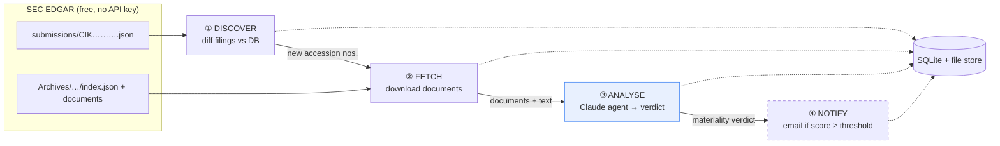
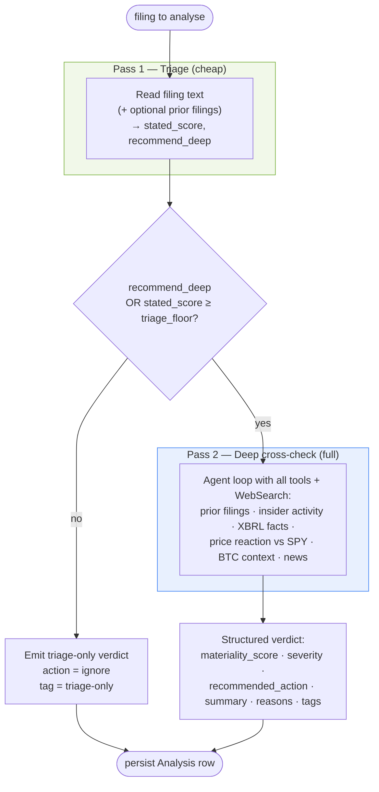
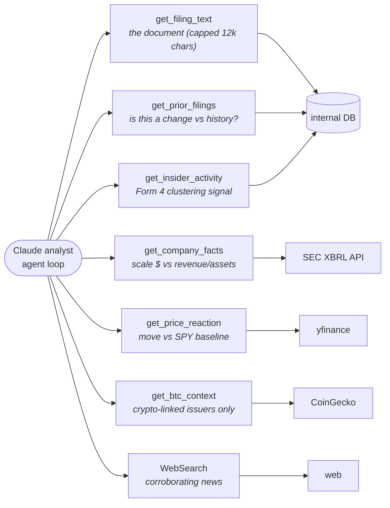
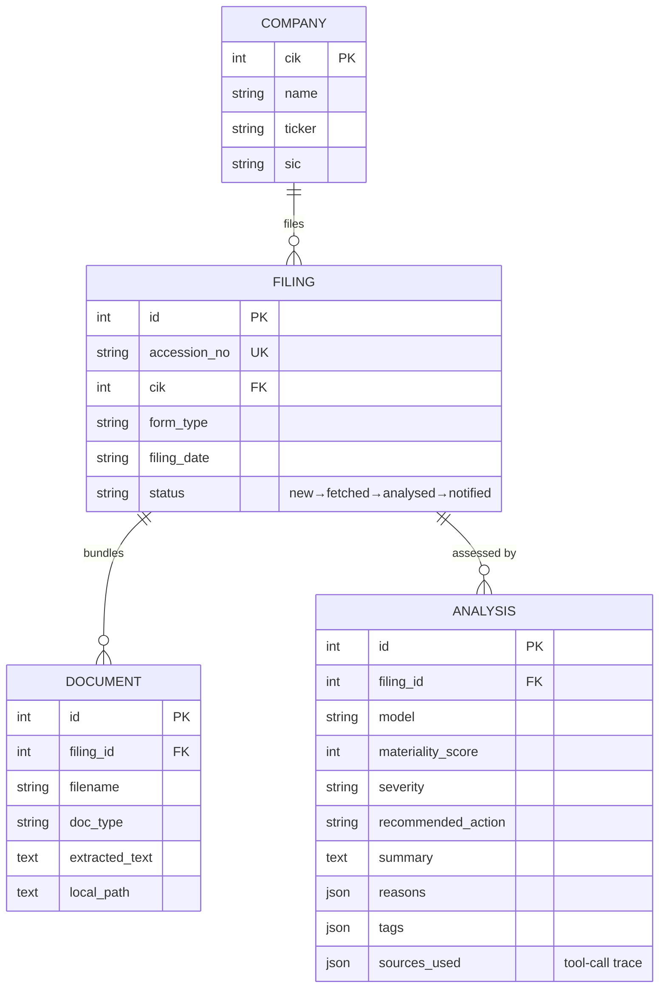
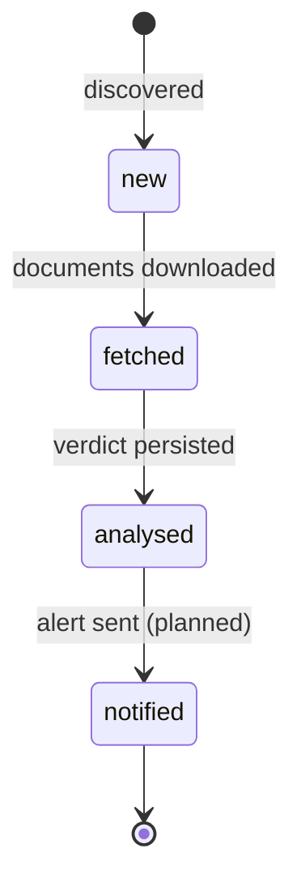

# SEC Notice Agent

**Watch SEC EDGAR for new company filings, have a Claude agent judge how *material* each one is, and surface an alert when something actually matters.**

Public companies file constantly — 8-Ks, 10-Qs, 10-Ks, insider Form 4s, exhibits. The overwhelming majority are routine. Buried in that stream are the few filings that move a stock: an acquisition, a guidance cut, a debt raise, a going-concern warning, a large bitcoin purchase or sale. Reading every filing by hand doesn't scale; keyword filters are noisy and miss novelty.

This project treats materiality as a **research question, not a regex**. For each filing it runs a Claude Agent SDK loop that reads the document, pulls supporting evidence from the company's own history, SEC fundamentals, and the market's actual price reaction, then returns a structured, evidence-cited verdict: a 0–100 materiality score, a severity, and a recommended action.

---

## The core idea: triangulate, don't trust the text

A filing can *claim* to be important and be ignored by the market; a quiet filing can move the stock. So the analyst never scores on the filing text alone — it reconciles **three lenses**:

| Lens | Question | Evidence sources |
|------|----------|------------------|
| **STATED** | What does the filing claim on its face? | The filing's own readable text |
| **RELATIVE** | Is this a *change* vs history, and how big relative to the company? | Prior filings, insider (Form 4) clustering, SEC XBRL fundamentals |
| **REALIZED** | Did the market *actually* react, de-confounded from broad moves? | Price/volume vs an SPY baseline, news via web search, BTC context for crypto-linked issuers |

A high *stated* importance the market shrugged off is **not** highly material. A quiet filing that moved the stock **is**. Realized reaction adjusts the score.

---

## How it works — the pipeline

The system is a four-stage, idempotent pipeline. Each filing carries a `status` that only ever advances, so re-running any stage is safe and never re-does work or re-alerts.



> **NOTIFY** (stage ④) is specified in [`CONCEPT.md`](CONCEPT.md) and reserved in the status lifecycle, but **email delivery is not yet implemented**. Today the analyst's verdict — including its `recommended_action: notify` — is persisted and printed; wiring it to email is the next step.

### Stage by stage

- **① Discover** — Pull a company's `submissions` JSON (the `filings.recent` block plus any overflow history files, stitched together), diff against the DB, and record any *new* accession numbers as `status="new"`. No HTML scraping — EDGAR publishes structured endpoints.
- **② Fetch** — For each new filing, read its `index.json`, download the primary document and exhibits to the file store, extract readable text, and advance to `status="fetched"`.
- **③ Analyse** — Run the AI analyst (see below) on each `fetched` filing of a *material* form type. Persist the verdict to the `analyses` table and advance to `status="analysed"`.
- **④ Notify** *(planned)* — Email an alert when `materiality_score` crosses the threshold, then advance to `status="notified"`.

All SEC traffic goes through a single rate-limited client that honors SEC's fair-access policy: a descriptive `User-Agent`, ≤10 req/s (throttled conservatively to ~6/s), and backoff on HTTP 429/5xx.

---

## Inside the analyst — a two-pass agent

The analyst (`src/sec_notice/agent/analyst.py`) is a Claude Agent SDK loop with a custom MCP tool server. To keep cost down, it runs in **two passes**, and the cheap pass gates the expensive one.



**Pass 1 — Triage.** A fast screener reads only the filing text (and optionally prior filings to judge novelty) and returns a `stated_score`, a one-line summary, and a `recommend_deep` boolean. Routine/administrative filings score low and stop here, emitting a cheap "triage-only" verdict — no market data, no web search.

**Pass 2 — Deep cross-check.** Only filings that clear the floor (or that triage flags as potentially market-moving) get the full agent loop, which is free to call every tool and the web to triangulate the three lenses.

### The analyst's toolbox

The agent reaches the outside world only through a fixed set of tools (`src/sec_notice/agent/datasources.py`). Every tool is defensive — on failure it returns an `{error: …}` dict rather than raising, so a flaky source never breaks the loop.



The agent is instructed to **cite or omit**: every number in its reasons must come from a tool result — no invented figures — and to **de-confound**: if the price move matches the market baseline, it doesn't credit it to the filing.

### The verdict

Each deep analysis returns a structured object (enforced via the SDK's `output_format` JSON schema):

```jsonc
{
  "materiality_score": 0-100,            // 0-39 info · 40-59 notable · 60-79 high · 80-100 critical
  "severity": "info|notable|high|critical",
  "recommended_action": "notify|watch|ignore",   // notify when ≥60 and genuinely actionable
  "summary": "2-3 sentences",
  "reasons": ["short, evidence-backed bullets"],
  "tags": ["…"]
}
```

---

## Data model



### Filing lifecycle

The `status` column is the pipeline's state machine — it only moves forward, which is what makes every stage idempotent.



---

## Getting started

### Requirements

- Python **3.11+**
- An **Anthropic API key** (for the analyst; discovery/fetch work without it)

### Install

```bash
git clone <repo-url> sec-notice-agent
cd sec-notice-agent
python -m venv .venv && source .venv/bin/activate
pip install -e .
```

### Configure

Create a `.env` in the project root:

```bash
# Required for the analyst (stage ③)
ANTHROPIC_API_KEY=sk-ant-…

# SEC fair-access identity (use your own contact)
SEC_USER_AGENT="SEC Notice Agent (you@example.com)"

# Optional — shown with defaults
DATABASE_URL=sqlite:///sec_notice.db
DATA_DIR=data/filings
ANALYST_MODEL=claude-opus-4-8
MATERIAL_FORMS=8-K,10-K,10-Q     # forms the analyst bothers with
MATERIALITY_THRESHOLD=60         # alert floor (for the planned notify stage)
TRIAGE_FLOOR=40                  # stated_score at/above which triage escalates to deep
```

---

## Usage

The pipeline is exposed as three CLI entry points. A typical run for one company (CIK `1050446` = MicroStrategy / Strategy):

```bash
# ② Discover + fetch a company's filings (newest first, capped at 5)
python -m sec_notice.discover 1050446 --forms 8-K --limit 5

# ③ Analyse the fetched filings (material forms only)
python -m sec_notice.analyse 1050446 --limit 5
```

Or ingest a single filing straight from its EDGAR URL, then analyse just that one:

```bash
# ① Ingest one filing by URL
python -m sec_notice.ingest https://www.sec.gov/Archives/edgar/data/1050446/000119312526249768/mstr-20260530.htm

# ③ Analyse it by id
python -m sec_notice.analyse --filing-id 1
```

### Discovery options

```
python -m sec_notice.discover <CIK> [options]
  --forms 8-K,10-K     only these form types (default: all)
  --limit N            download documents for at most N new filings (default: 10)
  --metadata-only      record filing metadata only; download no documents
  --all                download documents for every new filing (no limit)
```

### Reading the analyst output

Each verdict prints with a severity icon, the score/action, summary, evidence-backed reasons, and the tools the agent consulted. It also prints a **token/cost readout** per filing and a grand total for batch runs:

```
tokens : 92,400 total  (in 4,200, out 1,200, cache_read 68,000, cache_write 19,000)  [2 passes]  ~$0.4700
```

> **On token counts:** in an agentic loop the SDK's reported usage is *cumulative across turns*, so `cache_read` dominates the raw token total while contributing little to actual cost (cache reads are billed at ~0.1×). **Cost (USD) is the metric to watch, not the raw token count.** A routine filing reads `[1 pass]` (triage only); a material one `[2 passes]`.

---

## Project layout

```
src/sec_notice/
├── config.py            # env-driven configuration
├── discover.py          # CLI: discover + backfill a company
├── ingest.py            # CLI: ingest one filing by URL
├── analyse.py           # CLI: run the AI analyst + token readout
├── pipeline.py          # the four-stage pipeline orchestration
├── edgar/               # SEC EDGAR access
│   ├── client.py        #   rate-limited, retrying HTTP client
│   ├── discover.py      #   parse submissions JSON → filings
│   └── fetch.py         #   download a filing's documents + extract text
├── agent/               # Phase 3 AI analyst
│   ├── analyst.py       #   two-pass Claude Agent SDK loop + verdict schema
│   └── datasources.py   #   cross-check tools (DB, XBRL, yfinance, CoinGecko)
└── store/               # persistence
    ├── models.py        #   Company / Filing / Document / Analysis
    └── db.py            #   engine + session scope
```

---

## Status & roadmap

- ✅ **Phase 1** — Ingest a single filing from a URL.
- ✅ **Phase 2** — Discover a company's filings and backfill documents.
- ✅ **Phase 3** — AI materiality analyst (two-pass triage → deep cross-check, structured verdicts, token/cost readout).
- ⬜ **Phase 4** — Email notification when a verdict crosses the alert threshold.
- ⬜ **Scheduling** — A scheduler/loop that polls watched CIKs and runs the pipeline end-to-end on an interval.

See [`CONCEPT.md`](CONCEPT.md) for the original design rationale, including the EDGAR endpoint layout and compliance notes.
